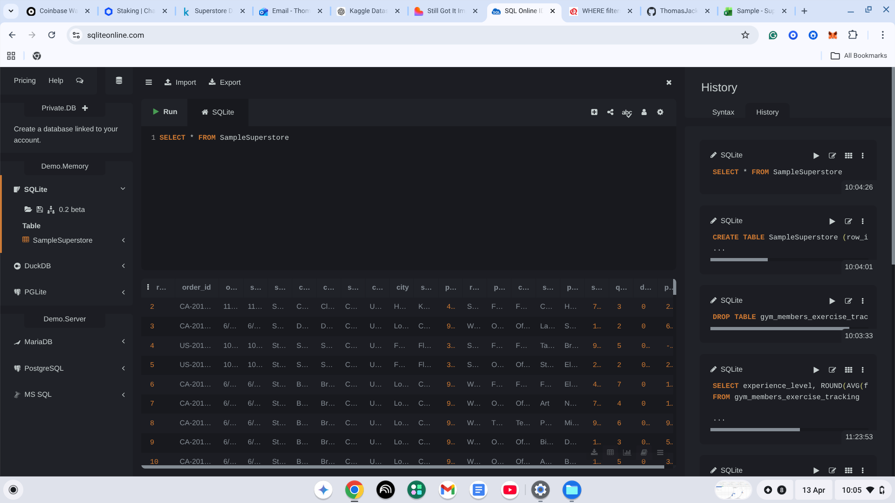
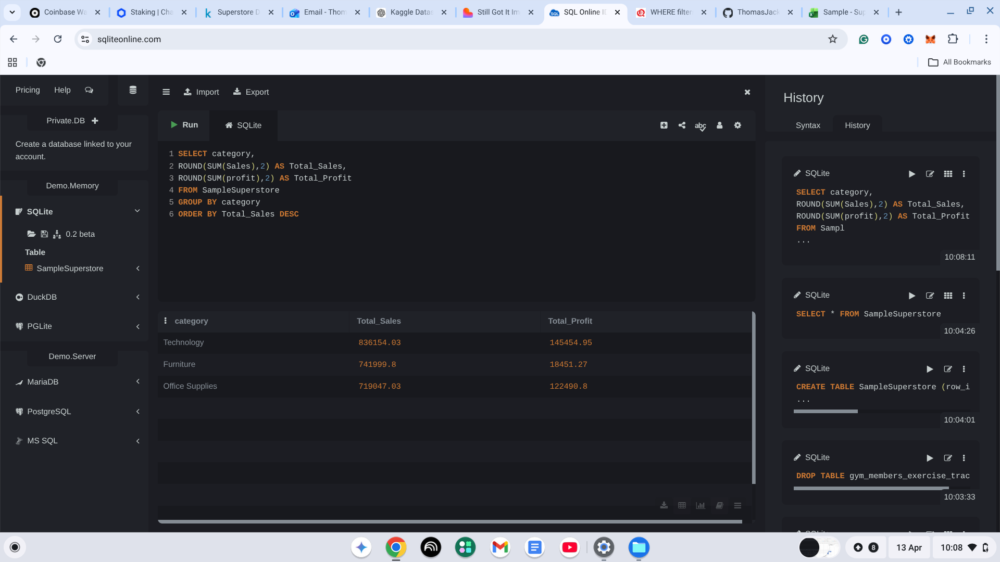
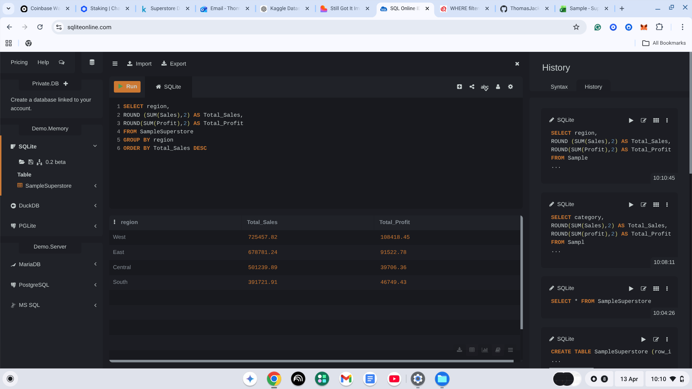
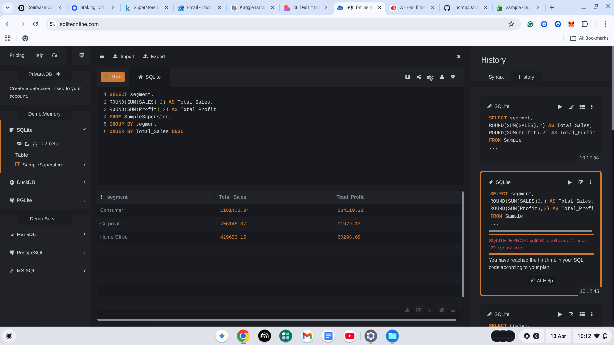
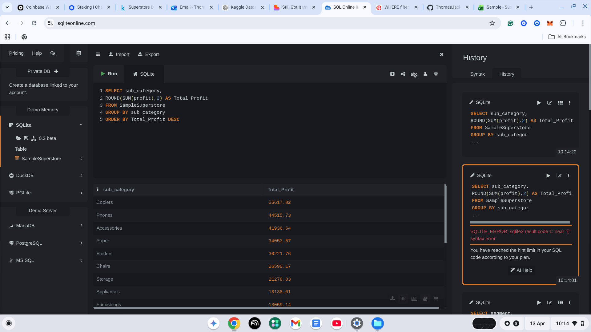
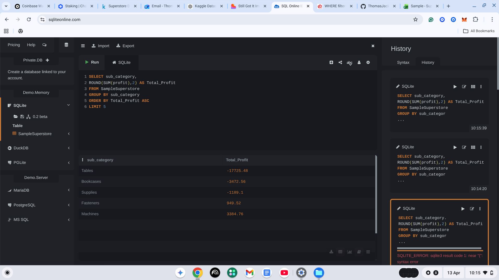

# SQL Analysis

## Overview
Queried the Sample Superstore dataset using SQL to validate and 
expand on findings from the Excel analysis, with a focus on 
profitability across categories, regions and segments.

## Tools Used
- SQLite Online
- Dataset: Sample Superstore (Kaggle)

## Skills Demonstrated
- SELECT, FROM, GROUP BY, ORDER BY
- Aggregate functions: SUM, ROUND
- Aliasing with AS
- Filtering with LIMIT

## Queries & Results

### Query 1 - Select All

### Query 2 - Sales and Profit by Category

### Query 3 - Sales and Profit by Region

### Query 4 - Sales by Segment

### Query 5 - Most Profitable Sub-Categories

### Query 6 - Loss Making Sub-Categories

## Key Findings
- Technology is the most profitable category
- Furniture generates strong sales but poor profit
- West region leads in both sales and profit
- Tables and Bookcases are the biggest loss making sub-categories

